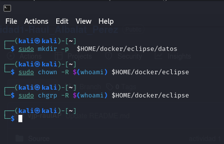
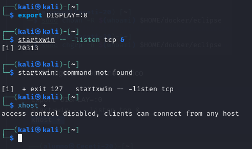
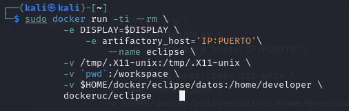
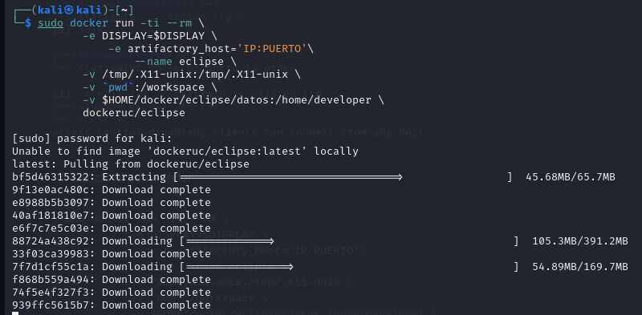
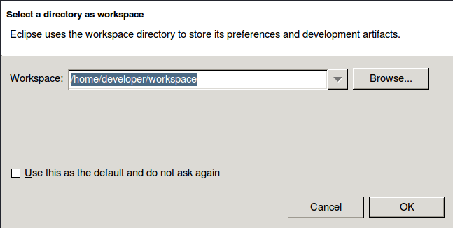
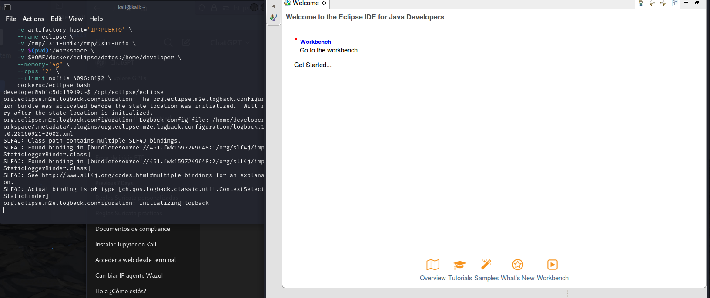
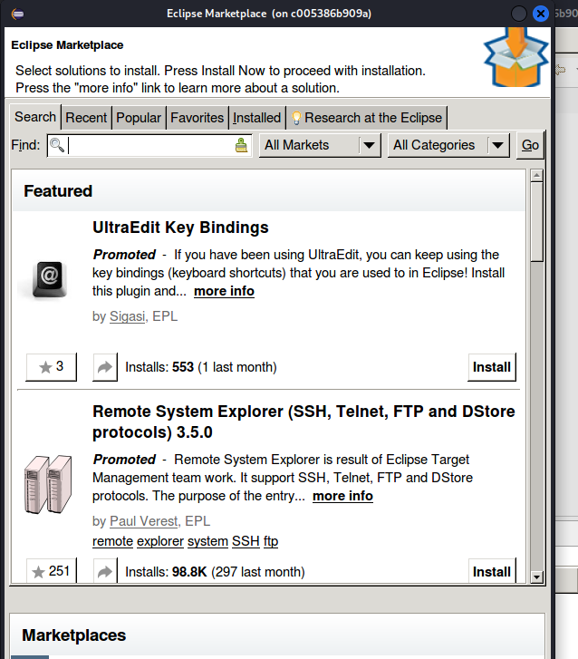
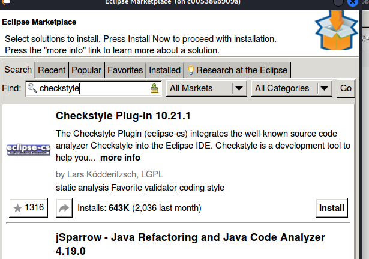
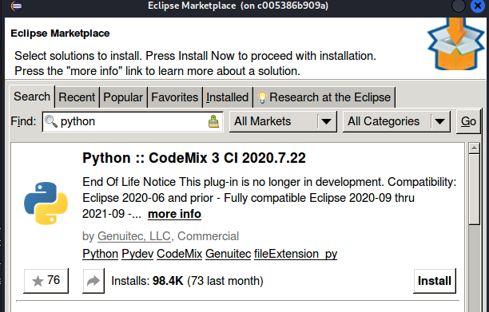
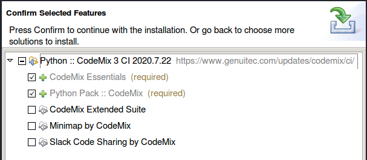

# PPS-Unidad1Actividad1- Raul_Albalat_perez
Actividad 1 de la Unidad 1 de Puesta en Producción Segura. Tabajaremos con los Entornos de Desarrollo

Tenemos varios objetivos:

> [Crear un entorno de desarrollo Eclipse con docker](#Eclipse-Docker)

> [Instalar extensiones en un IDE](#Instalar-extensiones)

> [Probar los entornos de Desarrollo](#Prueba-entornos) 
---
## Eclipse Docker

En [este enlace](https://hub.docker.com/r/dockeruc/eclipse) puedes encontrar podemos crear un contenedor docker con un entorno IDE Eclipse

Lee bien las instrucciones y ten en cuenta que tienes que hacer varias operaciones. Las que tienes a continuación son de un entorno Linux:

1. Crear las carpetas necesarias:
~~~
sudo mkdir -p  $HOME/docker/eclipse/datos
sudo chown -R $(whoami) $HOME/docker/eclipse
sudo chgrp -R $(whoami) $HOME/docker/eclipse
~~~
 **Creamos las carpetas necesarias:**
   - Se utiliza `mkdir -p` para crear la estructura de directorios donde se almacenarán los datos del contenedor Eclipse.

 **Cambiamos el propietario de las carpetas:**
   - `chown` asigna la propiedad de las carpetas y subcarpetas al usuario actual para garantizar acceso total.

 **Cambiamos el grupo de las carpetas:**
   - `chgrp` asegura que el grupo del usuario tenga los permisos necesarios sobre las carpetas.

2. Configurar el entorno gráfico 
   - Configuramos y permitimos que el contenedor Docker use la interfaz gráfica del sistema anfitrión, asegurando que las aplicaciones del contenedor puedan interactuar visualmente con el usuario.

~~~
export DISPLAY=:0
startxwin -- -listen tcp &
xhost + 
~~~

3. Lanzar el contenedor
   - Iniciamos un contenedor Docker que ejecute Eclipse con soporte para interfaz gráfica, permitiendo editar y desarrollar proyectos con persistencia de datos y configuración desde el host.

~~~
sudo docker run -ti --rm \
           -e DISPLAY=$DISPLAY \
	       -e artifactory_host='IP:PUERTO'\
		   --name eclipse \
           -v /tmp/.X11-unix:/tmp/.X11-unix \
           -v `pwd`:/workspace \
           -v $HOME/docker/eclipse/datos:/home/developer \
           dockeruc/eclipse	

~~~

    - Se nos arranca Eclipse

    - Pulsamos ok y se nos abre la pantalla principal de Eclipse.

> __Explica el comando docker que has utilizado__

# Explicaciones

## 1. `sudo docker run`
Inicia un contenedor Docker basado en la imagen `dockeruc/eclipse` con las configuraciones proporcionadas.

## 2. Opciones importantes

### `-ti`:
Habilita un terminal interactivo. Esto permite interactuar con el contenedor desde la terminal del sistema anfitrión.

### `--rm`:
El contenedor se eliminará automáticamente una vez que se detenga. Esto ayuda a evitar la acumulación de contenedores que no se están utilizando.

## 3. Variables de entorno

### `-e DISPLAY=$DISPLAY`:
Establece la variable de entorno `DISPLAY`, que indica al contenedor que debe utilizar el servidor gráfico del host para mostrar la interfaz gráfica de las aplicaciones ejecutadas dentro del contenedor.

### `-e artifactory_host='IP:PUERTO'`:
Define una variable personalizada llamada `artifactory_host`. Esta variable puede ser utilizada por el contenedor para configuraciones adicionales, como conectar a un servidor de Artifactory, si es necesario.

## 4. Volúmenes montados

### `-v /tmp/.X11-unix:/tmp/.X11-unix`:
Comparte los sockets X11 entre el host y el contenedor, lo que permite que las aplicaciones gráficas ejecutadas en el contenedor se muestren en la pantalla del host.

### `-v $(pwd):/workspace`:
Monta el directorio actual del host (donde se ejecuta el comando) como `/workspace` dentro del contenedor. Esto facilita el acceso a los archivos del proyecto desde dentro del contenedor.

## Instalar extensiones

Las extensiones de un IDE nos van a facilitar la labor de programar, hacer más flexible nuestro IDE, además de hacer nuestros código más seguro.
Tenemos muchas extensiones, tanto para lenguajes de programación específicos como para el IDE.
1. **Abrir Eclipse:**
   Con Eclipse en funcionamiento, abro el IDE 

2. **Accedo al Marketplace de Eclipse:**
   - En menú superior y selecciono **Help** (Ayuda).
   - En el menú desplegable, selecciono **Eclipse Marketplace**.

3. **Buscar una extensión:**
   - En la ventana de Eclipse Marketplace, usamos la barra de búsqueda para encontrar extensiones.
   - Podemos buscar por nombre de la extensión, por ejemplo, `Checkstyle`, `Sonar Lint`, o por el tipo de funcionalidad que necesitamos (por ejemplo, "Java" o "Python").

4. **Instalar la extensión:**
   - Una vez que encuentramos la extensión que deseamos instalar, hacemos clic en el botón **Go** junto a la extensión para instalarla.

   - Hacemos clic en **Install** (Instalar) y seguimos los pasos para completar la instalación.

   

   - Es posible que Eclipse nos pida reiniciar para completar la instalación. Si es así, selecciona **Yes** (Sí).

5. **Configurar la extensión (si es necesario):**
   - Algunas extensiones requieren configuración adicional. Puedes acceder a las configuraciones a través de **Window** > **Preferences** en el menú principal y buscar la sección correspondiente a la extensión que acabas de instalar.

__Las siguientes operaciones las puedes hacer desde el entorno Eclipse que hemos creado o puedes utilizar el IDE que prefieras en tu equipo__
>__Busca cuáles son las mejores extensiones de eclipse para programadores y las añades desde la tienda de tu IDE__
>__ Busca y escribe para qué sirven estos plugins: Checkstyle, Sonar Lint.__
>__Instala los plugins y complementos que has encontrado. Además busca e instala los plugins Checkstyle y Sonar Lint.__

## Prueba entornos

El entorno de desarrollo nos sirve para crear nuestras aplicaciones y además podemos comprobar los errores que tienen, problemas de seguridad, etc. por lo que desde allí vamos a poder corregirlos.
>__Descarga el código fuente de un proyecto java o python: compila, enlaza y ejecutaló. Tienes algunos ejemplos en la carpeta Sources de este repositorio__
>__Utiliza las herramientas de depuración de Eclipse o Netbeans para depurar el proyecto, y las diferentes extensiones para ver información, problemas, etc.__

---
## ENTREGA
>__Crea un repositorio  con nombre PPS-Unidad1Actividad1-Tu nombre que contenga las respuestas a las preguntas y las evidencias de que has realizado las operaciones indicadas.__

>__Sube a la plataforma, tanto el repositorio comprimido como la dirección a tu repositorio de Github.__
